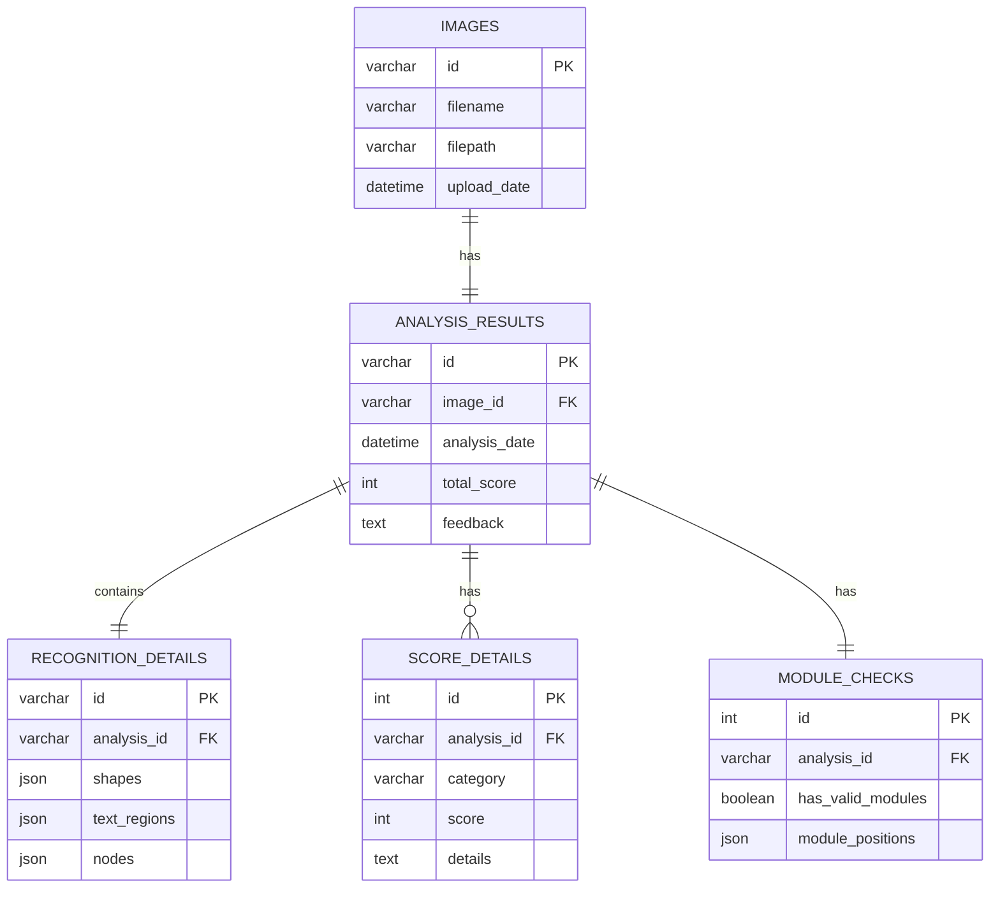

# 流程图分析系统数据库ER图

## 数据库表说明

### 1. 图像表 (images)
- **功能**: 存储上传的流程图图像
- **字段**:
  - `id`: UUID主键
  - `filename`: 原始文件名
  - `filepath`: 文件在服务器上的存储路径
  - `upload_date`: 上传日期和时间

### 2. 分析结果表 (analysis_results)
- **功能**: 存储流程图分析的主要结果
- **字段**:
  - `id`: UUID主键，与图像分析会话关联
  - `image_id`: 外键，关联到图像表
  - `analysis_date`: 分析日期和时间
  - `total_score`: 总分
  - `feedback`: 总体反馈意见

### 3. 识别详情表 (recognition_details)
- **功能**: 存储图像识别的详细信息
- **字段**:
  - `id`: UUID主键
  - `analysis_id`: 外键，关联到分析结果表
  - `shapes`: JSON格式的形状识别结果
  - `text_regions`: JSON格式的文本区域识别结果
  - `nodes`: JSON格式的节点识别结果

### 4. 评分细则表 (score_details)
- **功能**: 存储各评分类别的详细分数
- **字段**:
  - `id`: 自增主键
  - `analysis_id`: 外键，关联到分析结果表
  - `category`: 评分类别（如结构、内容、美观等）
  - `score`: 该类别的分数
  - `details`: 评分说明

### 5. 模块检查表 (module_checks)
- **功能**: 存储流程图中模块组合的检查结果
- **字段**:
  - `id`: 自增主键
  - `analysis_id`: 外键，关联到分析结果表
  - `has_valid_modules`: 是否包含有效模块
  - `module_positions`: JSON格式的模块位置数据

## 优势
1. **数据结构更清晰**: 按照功能将数据分类，每个表专注于特定类型的数据
2. **查询更高效**: 可以只查询需要的数据，不必加载完整的JSON
3. **数据完整性**: 使用外键约束确保数据引用的完整性
4. **扩展性更强**: 新功能可以通过添加新表或字段来实现，而不必修改现有结构
5. **降低数据冗余**: 避免在单一表中存储大量重复数据 